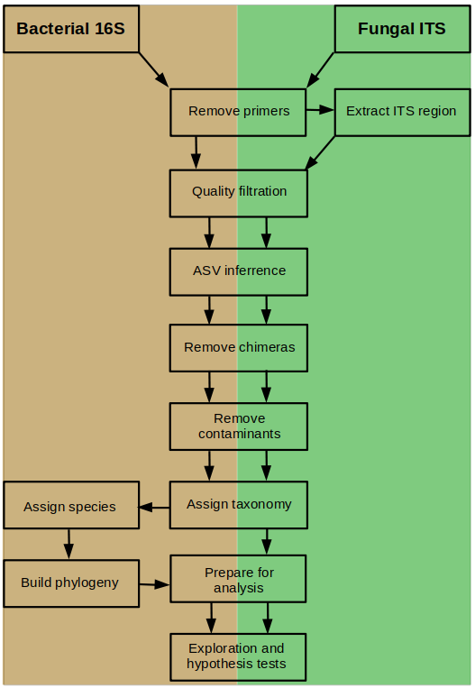
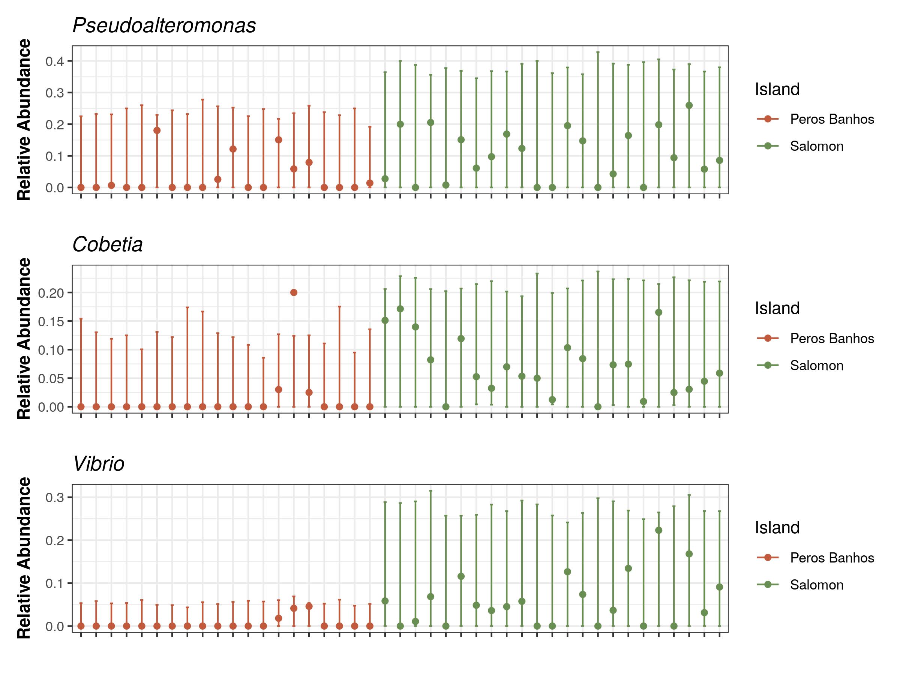

[](http://www.gnu.org/licenses/gpl-3.0)

# Data, Code and Workflows Guideline

Here we briefly introduce the specific purposes of the dir system:


1. __cache__: Here, we store intermediate datasets and results that are generated during the workflow steps.
2. __graphs__: The graphs/figures produced during the analysis.
3. __input__: Here, we store the raw input data. 
4. __lib__: The functions used within the workflow.
5. __output__: The final output results of the workflow.
6. __workflow__: Step by step pipeline. 
7. __README__: This document

## Overview of the workflow: Processing meta-amplicon sequence data

This is an overview of the major workflow steps when processing meta-amplicon reads.



## Installation

- __Running environment__: 
    - The workflow was constructed based on __Linux Ubuntu 18.04.5 LTS__.

- __Required software and versions__: 

- [cutadapt](https://cutadapt.readthedocs.io/en/stable/changes.html#v2-1-2019-03-15) (Martin, 2011; version 2.10)
- [ITSxpress](https://github.com/usda-ars-gbru/itsxpress) (Rivers et al., 2018; version 1.0)
- [R](https://www.R-project.org/) (R Core Team, 2017; version 3.6.3)
- [tidyverse](https://www.tidyverse.org/) (Wickham et al., 2019; version 1.3.0)
- [DADA2](https://benjjneb.github.io/dada2/) (Callahan et al., 2016; version 1.14.1)
- [decontam](https://benjjneb.github.io/decontam/) (Davis et al., 2018; version 1.6.0)
- [phyloseq](https://joey711.github.io/phyloseq/) (McMurdie & Holmes, 2013; version 1.30.0)
- [Biostrings](http://www.bioconductor.org/packages/release/bioc/html/Biostrings.html) (Pagès et al., 2021; version 2.54.0)
- [phangorn](https://CRAN.R-project.org/package=phangorn) (Schliep, 2011; version 2.2.5)
- [msa](https://bioconductor.org/packages/release/bioc/html/msa.html) (Bodenhofer et al., 2015; version 1.18.0)
- [ShortRead](https://bioconductor.org/packages/release/bioc/html/ShortRead.html) (Morgan et al., 2009; version 1.44.3)
- [corncob](https://CRAN.R-project.org/package=corncob) (B. D. Martin et al., 2020; version 0.2.0)
- [vegan](https://CRAN.R-project.org/package=vegan) (Okansen et al., 2016; version 2.6.0)
- [patchwork](https://CRAN.R-project.org/package=patchwork) (Pedersen, 2020; version 1.0.1)
- [RStudio 1.2.5033](https://rstudio.com/)


## Input Data

The example data used here represent the paired-end fastq files generated by the Illumina sequencing platform. The example data files are derived from bacterial 16S amplicon reads taken from seagrass (_Halophila ovalis_).
This workflow can be easily adapted to work with fungal ITS amplicon data as well. Varying steps are noted in the workflow image and in the manuscript.
Input data files are compressed with gzip to save space. All of the tools in this workflow can process gzip compressed fastq files.

- Example R1 FASTQ file: `input/2554_pass_1.fastq.gz`  
- Example R2 FASTQ file: `input/2554_pass_2.fastq.gz`  

Each entry in a FASTQ files consists of 4 lines:  

1. A sequence identifier with information about the sequencing run and the cluster. The exact contents of this line vary by based on the BCL to FASTQ conversion software used.  
2. The sequence (the base calls; A, C, T, G and N).  
3. A separator, which is simply a plus (+) sign.  
4. The base call quality scores. These are Phred +33 encoded, using ASCII characters to represent the numerical quality scores.  

The first entry of the input data:
```
@SRR11142554.8310.1 8310 length=301
TACGTAGGGTGCAAGCGTTAATCGGAATTACTGGGCGTAAAGCGTGCGCAGGCGGTTATATAAGACAGGTGTGAAATCCCCGGGCTCAACCTGGGAACTGCATTTGTGACTGTATAGCTAGAGTACGGCAGAGGGGGATGGAATTCCGCGTGTAGCAGTGAAATGCGTAGATATGCGGAGGAACACCGATGGCGAAGGCAATCCCCTGGGCCTGTACTGACGCTCATGCACGAAAGCGTGGGGAGCAAACAGGAGTAGAAACCCCAGTAGTCCGGCTGACGGACGAACCGTTCCAGAAACA
+
CCCCCGGGGCFECGGDGFGDGCFCCFFDGGGGCDDGD@CEGGGDFGGFFDFGGDC88CCFEFGDDEDD@88CCFFFGFFGD>D=B>A8<=<DDFDC8D?D?D<=,@,=FEECFFFFFGCFGFEEGF@?BEGGGFEGGEFGGDFFGFGFEDBBFGEFDE@CDFCFFFEFGDGFGCG79CE>ACFFGFDGEDD?@BFGGGGGF4;3=56<:FBF<GFFFFBFF?:?:>963.5349?FF6346CE?9>?<:-+08/+,,<<:@@C>*22.9.244:)((283(34((-4(-,(0(*..54)(.

```


## Major steps

#### Step 1: pre-processing reads
`workflow/00_Remove_Primers.R` runs _cutadapt_ to remove primers from 16S and ITS reads
`workflow/00_Trim_ITS_Region.R` is used only when processing fungal ITS reads; runs _itsxpress_ to trim conserved regions from ends of amplicons

```
Rscript workflow/00_Remove_Primers.R
Rscript workflow/00_Trim_ITS_Region.R # do not run if using bacterial 16S amplicons
```

#### Step 2: build an ASV table from input files
`workflow/01_Process_Raw_16S_Reads.R` carries out the _DADA2_ pipeline for error correction, variant calling, ASV table generation, and taxonomic assignment


```
Rscript workflow/01_Process_Raw_16S_Reads.R # can be run on ITS reads as well with minimal changes (noted in code)
```

#### Step 3: build a phylogeny
`02_Build_and_add_Phylogeny.R` estimates a phylogenetic tree of your bacterial 16S variants and adds it to your ASV table


```
Rscript workflow/02_Build_and_add_Phylogeny.R # do NOT run if using fungal ITS amplicons
```

#### Step 4: cleaning and exploring your data set
`03_Clean_and_Explore_Data.R` performs a quick cleanup to remove non-target sequences (such as chloroplast DNA)
`04_Explore_and_Test_Hypotheses.R` is an example of how to use the _phyloseq_ package to explore your ASV table and perform common hypothesis tests (e.g., PermANOVA, differential abundance testing)


```
Rscript workflow/03_Clean_and_Explore_Data.R
Rscript workflow/04_Explore_and_Test_Hypotheses.R
```


## Expected results




## License
It is a free and open source software, licensed under []() (choose a license from the suggested list:  [GPLv3](https://github.com/github/choosealicense.com/blob/gh-pages/_licenses/gpl-3.0.txt), [MIT](https://github.com/github/choosealicense.com/blob/gh-pages/LICENSE.md), or [CC BY 4.0](https://github.com/github/choosealicense.com/blob/gh-pages/_licenses/cc-by-4.0.txt)).
